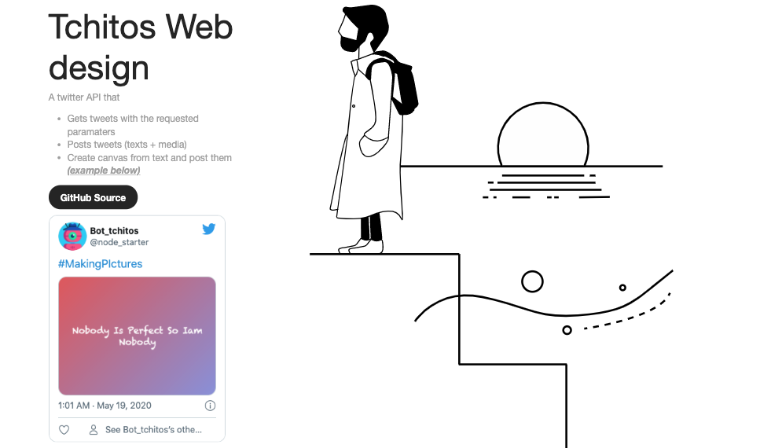

# On this master branch 

> This is my fun nodejs twitter api 




## So in a nutshell

  > Getting tweets with the requested paramaters (search, language, Geo tags ...) 

  > Posting tweets "texts + media (photos, gifs, videos) "

  > Creaing images from texts and posting them

> Feel free to check my twitter example:  https://twitter.com/node_starter


## How to use
  
  Make sure to set up a ".env" config file to set up variables like 
  
    
```bash
CONSUMER_KEY = XXXXXX
CONSUMER_SECRET = XXXXXX
ACCESS_TOKEN = XXXXXX-XXXXX
ACCESS_TOKEN_SECRET = XXXXXX
```
  then run these commands 
  
```bash
npm i

npm start

#with nodemon (restart server with every save)
npm run dev

```


> For more informations: https://developer.twitter.com
